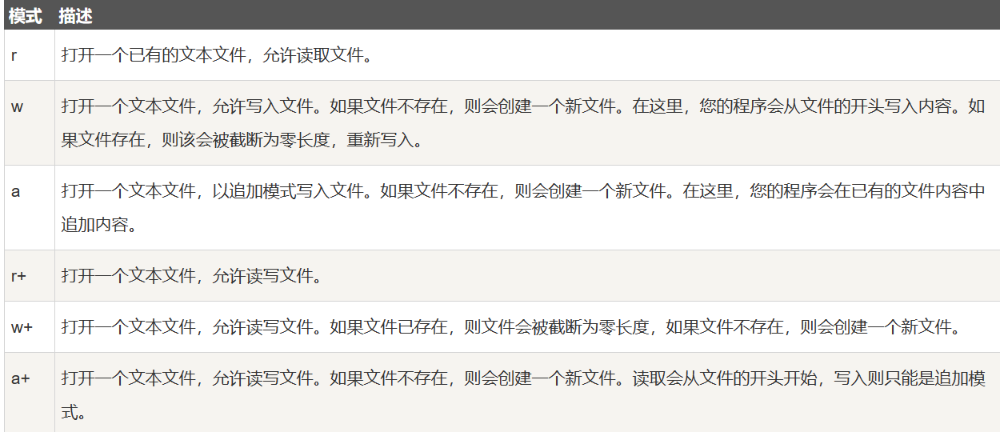
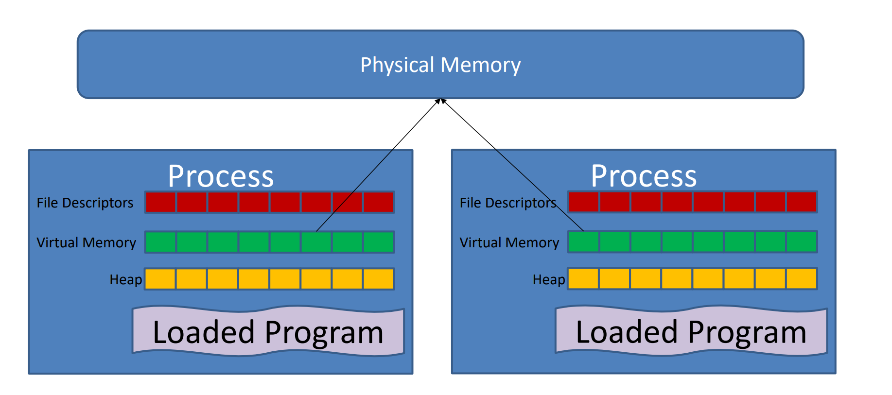

# 软硬件程序设计接口

## 负数

负数在计算机中使用补码表示，补码=原码取反+1，而正数的补码等于原码。计算机不会减法，遇到减法的时候会转换为加法，而负数用补码的形式表示实际上就是在找一个用相同效果的正数以此来代替参与运算。

在实际计算中：-1+127=1111 1111 +0111 1111=255+127由于是8位数的大小相加会溢出因此最后的结果是126。

8位下无符号整数可以表示[0,255)，而有符号整数（最左边的一位作为符号位）可以表示[-128，127)，因为在这种表示下会出现两个0这里只保留正0而负0则表示为-128。

## 浮点数

计算机中浮点数由三部分组成，最左边的符号位，紧接着的阶码，最后是尾数部分。

其中阶码使用移码表示=真值+偏移值（$2^{n-1}-1$​），其中n是阶码的长度在8位下表示为127（0111 1111），阶码可正可负但是在实际计算中为了快速高效通过偏移值把阶码全部表示为正数。对于-126在阶码下就是1000 0010+0111 1111=0000 0001=1，因此阶码不会有符号位。


对于尾数部分：


对于给定的十进制小数转换为二进制后比如1101.1010，需要变为1.1011010的形式其中小数点后面的部分就是尾数。


二进制浮点数：1 10000001 010 0000 0000 0000 0000 0000 真值为：符号位为1表示负数，阶码表示为 10000001=129=真值+127，因此阶数=2，而尾数部分等于0.5，最后的结果就是-5.


## 命令

clear 清楚窗口

ls -l 打印出当前目录下所有的文件

cd ? 进入到当前目录下的某个文件，如果当前文件下有一个ach的文件可以通过cd ach进入，如果不在当前目录下通过cd /mnt去到mnt文件。Linux系统下想要访问到window的文件通过cd /mnt/c进入到C盘。cd ..可以返回到父文件夹。

mkdir name/ rmdir name 在当前文件夹下创建/删除文件

pwd打印出当前位置

echo "填入要输出的内容"可以用于打印内容 prinft "填入要输出的内容"可以做到同样的效果，不过前者会自动给出换行符

man 1 printf给出操作手册


	

到达Ubuntu储存文件的位置。


## 运行代码

在当前目录下，用记事本创建C代码后，使用命令 gcc filename.c -o newname，这段命令可以将源代码编译，创建一个新的newname的编译后的代码文件，-o用于给编译后的文件重命名，如果不加-o则默认名为a.c。

通过命令./filename 可以运行编译后的代码


## C语言


### 数据类型


float:6 位有效位 double:15 位有效位

数据类型转换：隐式转换是从小到大自动发生，如int类型相除就是整除，如果想要小数需要float(a)/float(b)。

使用int与char类型比较的时候，比较的实际是char类型的ASCILL码。


### 格式化输出

输出使用函数只能是输出""包围的


通过占位符实现


注意必须是双引号

注意f只能输出6位，多出了会四舍五入,f表示单精度 lf表示双精度。 

```c
#include <stdio.h>

int main() {
    int a = 1;
    float pi = 3.1415926;
    printf("this is just test %d, do you know what is %f, and my name is %s", a, pi, "zhoumingyu ");
    return 0;
}

// 前面的数字表示长度不能小于给定的数组如果小于用空格补齐，默认是右对齐，在数字前面加上-表示左对齐
printf("%15s", "hello world");
//.加数字表示取截取多少字符
printf("%.1s", "hello world");

printf("%15.10s:”, “Hello, world!”);
```


### 三元运算符


### 常量

整数常量可以是十进制、八进制或十六进制的常量。前缀指定基数：0x 或 0X 表示十六进制，0 表示八进制，不带前缀则默认表示十进制。

整数常量也可以带一个后缀，后缀是 U 和 L 的组合，U 表示无符号整数（unsigned），L 表示长整数（long）。后缀可以是大写，也可以是小写，U 和 L 的顺序任意。

```C
212         /* 合法的 */
215u        /* 合法的 */
0xFeeL      /* 合法的 */
078         /* 非法的：8 不是八进制的数字 */
032UU       /* 非法的：不能重复后缀 */
```


浮点常量由整数部分、小数点、小数部分和指数部分组成。您可以使用小数形式或者指数形式来表示浮点常量。

当使用小数形式表示时，必须包含整数部分、小数部分，或同时包含两者。当使用指数形式表示时， 必须包含小数点、指数，或同时包含两者。带符号的指数是用 e 或 E 引入的。

```C
3.14159       /* 合法的 */
314159E-5L    /* 合法的 */
314E5L	/* 合法的 */
510E          /* 非法的：不完整的指数 */
210f          /* 非法的：没有小数或指数 */
.e55          /* 非法的：缺少整数或分数 */
```


定义常量的两种方式：使用 **#define** 预处理器： #define 可以在程序中定义一个常量，它在编译时会被替换为其对应的值，不仅可以定义整数还可以定义浮点数。注意不能有分号


使用 **const** 关键字：const 关键字用于声明一个只读变量，即该变量的值不能在程序运行时修改

```python
const int MAX_VALUE = 100;
```


### 随机数

导入库<stdlib.h>

```c++
#include<stdio.h>
#include<stdlib.h>

#define SIZE 6
#define SEED 973
#define Count 6000

int main() {
	int frequence[SIZE];
	for (int i = 0; i < SIZE; i++) {
		frequence[i] = 0;
	}
        // 设置其中的随机数种子
	srand(SEED-1);
	
        // 使用函数随机
	for (int i = 0; i < Count; i++) {
		frequence[rand() % SIZE]++;
	}
	for (int i = 0; i < SIZE; i++) {
		printf("%d : %d\n",i+1,frequence[i]);
	}
}
```


### 数组

```c
int main(void) {
        // 静态定义数组给定数组的大小，不能超出
	int arr[3] = { 1,3,5};
	int a[3];
        // 可以同时赋值并且不给大小
	int b[] = { 1,2,3,4 };
	int* c = new int[100];
        
        // sizeof返回的是比特大小
        printf("%d", sizeof(a)/sizeof(a[0]));
    
        int *p;
        p=arr;
        p++;// 通过指针的自增可以实现对数组元素的访问，注意这里指针的自增依次增加4即Int的大小，也就是自增的大小与与所指使的数据类型有关
}
```

注意不能修改数组头，比如a++,a--之类的操作，只能通过其他的指针实现。


注意括号位置可以实现不同的功能


注意自增的操作顺序，前自增是先增加在返回，后自增是先返回在增加。


二维数组的定义：


**注意不能把数组赋值给另一个数组！**


动态分配数组：

通过malloc函数动态分配内存，用指针形式操作数组


没有办法直接分配二维的数组，只能通过转换为一维数组表示，或者给出n行数组的指针如下：
	


### 字符串

`字符串就是以null结尾的一维字符数组`

```C
// 定义的两种方式，如果规定了大小需要考虑留一位给结尾，可以少于但不能多
char site[7] = {'R', 'U', 'N', 'O', 'O', 'B', '\0'};
char site[7]={'1','2','3','\0'}
// 以下两种会默认加上\0在后面，使用sizeof(s)会默认计算结尾的\0
char site[] = "RUNOOB";
char *s="zhoumingyu"
注意字符串中用数组初始化的时候，最后一定要在字符串末尾加上\0，末尾的\0不能被替换掉否则在输出和使用的时候不知道终点
    
// 如果要创建字符串数组需要使用花括号    
char* arg[] = {"grep", "--color=auto", "-n", "fork", "man2fork.txt", NULL};
```


```C
#include <stdio.h>
// 调用库
#include<string.h>
int main(void) {
	char s1[20] = "hello ";
	char s2[20] = "world";
	char s3 [20];

        // 将s2连接到s1上，会改变s1
	strcat_s(s1, s2);
        // 将s1复制给s3
	strcpy_s(s3, s1);
	// 注意字符串必须要足够的空位才能复制和拼接，因为字符串不会自动扩展，一旦位置不够就会报错
        // 在copy函数中如果复制的字符串小于目标字符串那么目标字符串会被替换为复制的字符串，因为复制字符串的\0也一并复制过去了使得目标字符串提前结束
        printf("%s\n", s3);
        
        // 打印长度
	printf("%d", strlen(s3));
    
        strcmp(s1, s2);
	// 如果 s1 和 s2 是相同的，则返回 0；如果 s1<s2 则返回小于 0；如果 s1>s2 则返回大于 0。
}
```


其他的函数还有

void * memcpy (void *s1, const void *s2, size_t n)将s2中的n个字节复制到s1中，和strcpy一样会提前截断字符串，当大小不够的时候会报错。

int memcmp (const void *s1, const void *s2, size_t n) 比较两个字符串中的给定的n字节的字典序，如果前一个更大返回1反之返回-1，相同返回0，这里n的大小超出不会有事。

void * memset (void *s, int c, size_t n) 把字符串的前n个设置为c，注意要自己加上尾0

以上三个函数的n都是比特位为单位，但是对于字符串来说直接就是1(sizeof(char)=1)

```python
#include<stdio.h>
#include<string.h>
int main() {
	char s[] = "12345";
	char t[] = "67";
        int res;
        // 比较函数，第三个参数是比较的字符数，注意传入sizeof是不对的
	res=memcmp(t,s, sizeof(s));
    
    
    
        // 复制函数，第三个参数传入字符串的字节大小 
	memcpy(t,s, sizeof(s));
	printf("%s\n", s);
	printf("%d", sizeof(s) / sizeof(char));
    
        // 赋值函数
        char s[10];
        memset(s, 't',9*sizeof(char));
        s[9] = '\0';
        printf("%s\n", s);
}
```


函数int sprintf (char *str, const char *fmt, arg1, …,argn)可以将格式化的输入储存到字符串中并自动加上尾0，注意目标字符串必须有足够的空间。

```python
#include <stdio.h>
#include <math.h>

int main()
{
   char str[80];

   sprintf(str, "Pi 的值 = %f", M_PI);
   puts(str);
   
   return(0);
}
```


### 结构体


```C
#include<stdio.h>
// 定义结构体，里面可以包括其他的结构体，如果包括同类型的结构体必须是指针类型
struct SIMPLE {
	int a;
	double b;
	char* c[20];
	struct SIMPLE* next;
} s1,s2;
// 在结尾的分号前可以同时创建并初始化

typedef struct SIMPLE S;


int main() {
        // 通过.访问
	s1.a = 10;
    
        // 如果访问未初始化的值会报错 
	printf("%d", s1.a);
    
        // 必须带上完整的定义
        struct SIMPLE s3;
        // 或者通过typedef 定义的新名字
        S s3;
	s3.a = 10;
	printf("%d", s3.a);
        // 结构体数组的定义 , 与一般的数组一样可以使用指针操作
        S arr[5];
}
```


```C
#include<stdio.h>

struct BOOK {
	char title[20];
	char author[20];
	int id;
} b1={ "C 语言", "RUNOOB", 123456};
// 用给定的值初始化

int main() {
	// 定义指针
        BOOK* b = &b1;
	// 对于指针类型使用->访问，非指针类型通过.访问
        printf("%d", b->id);
}
```

结构体的大小比较有意思：他的大小是其中最大类型的整数倍，且满足对其规则，比如一个储存了int 和pointer的结构体，其中最大的是指针类型占8个字节为了保证对齐


总的来说在计算过程中先求出字节总和然后往最大的字节的倍数靠


### 位域

有些信息在存储时，并不需要占用一个完整的字节，而只需占几个或一个二进制位。例如在存放一个开关量时，只有 0 和 1 两种状态，用 1 位二进位即可。为了节省存储空间，并使处理简便，C 语言又提供了一种数据结构，称为"位域"或"位段"。

所谓"位域"是把一个字节中的二进位划分为几个不同的区域，并说明每个区域的位数。每个域有一个域名，允许在程序中按域名进行操作。这样就可以把几个不同的对象用一个字节的二进制位域来表示。

位域定义在结构体中，位域中的数据类型只能是int, unsigned int, signed int，随后跟着的是定义的字段宽度，这里的宽度表示是位的大小，宽度不能大于它对应的数据类型

```C
struct bs{
    int a:8;
    int b:2;
    int c:6;
}data;
```

上述结构的大小是4个字节，实际上大小看的是int的类型与字段宽度关系不大，但是如果有5个int a:8那么占据的大小将是8字节，因为要考虑结构体的对齐原则。

如果给其中的某个变量赋超出范围的值，这个变量不会被赋值


如图所示的程序输出的结果是disabled，因为位域中默认定义的是无符号整型，且它的宽度为1只能表示-1和0，当给它赋值为1是它会被解释为-1，因此最后的结果不正确。如果将位域的类型设置为unsigned可以解决问题。


带有位域操作的代码时machine depedent


### 字符串转化为数值

通过函数atoi将字符换转化为整型

此外还有 atof – converts from string to double, atol – converts from string to long包含在stdlib.h库中


### 输入输出

使用函数getchar()读取字符，该函数会读取每一个字符包括空白字符返回他们的ASCILL码形式，通过判断是否等于EOF，来找输入的结尾


与之对应的是putchar

```C
#include <stdio.h>
int main() {
	for (char ch = 'a'; ch < 'z'; ch++)
		putchar(ch);
}
```


函数fgets()用于文件读取的，将最后一个参数作为stdin可以从键盘读取内容，第一个参数是传入到那个字符数组，会默认地在数组的结尾加上\0，第二个参数是读取多少个数字，注意要留一个给最后的\0，注该函数读取一行。

函数fprintf()，第一个参数最为输出到的位置，后两个用于格式化输出。

简单的使用puts（接受一个字符串）函数也可以输出内容。

```python
#include <stdio.h>
int main() {
	char* str[255];
	fgets(str,255,stdin );
	fprintf(stdout, "I have just write: %s", str);
	return 0;
}
```


### 分配内存

使用函数malloc返回分配内存的首地址，可以认为是void*类型，如果不足以分配内存会范围null。

一般单配sizeof使用


### 文件读取

在stdio库中专门定义了File类型，通过函数fopen()打开文件，注意打开后在结尾需要加上close函数关闭文件	

```python
FILE *fopen( const char *filename, const char *mode );#返回的是指向file的指针，注意要经常查看fopen()函数返回的结果是否是null，注意打开方式不能是字符

# VS中打开方式
fopen_s(&fp,filename ,"r");
```

该函数接收函数名作为第一个参数，第二个参数是文件的打开方式：



对于二进制文件，打开方式都要追加一个b字符,rb wb ab 


```python
 int fclose( FILE *fp ); #与fopen()对应的是fclose()用于关闭文件
```


写入：

```python
int fputc( int c, FILE *fp );# 如果错误返回EOF
int fputs( const char *s, FILE *fp );# 如果错误返回EOF
int fprintf(FILE *fp,const char *format, ...)# 直接写入字符串
```

读取（注意每一次的读取都是接着前面的，不会是重新开始）：

```python
int fgetc( FILE * fp );#读取一个字符， 如果错误返回EOF
char *fgets( char *buf, int n, FILE *fp );# 读取指定长度的字符，遇到换行或者EOF会停止，读取到了末尾会返回EOF,会默认在结尾加上\0
 int fscanf(FILE *fp, const char *format, ...);# 在遇到第一个空格和换行符时，它会停止读取
```


对于文件名，可以通过命令行输入，调用如下：


第一个代表参数的数量./d a.c b.c 的argc是3，因为会储存可执行文件的名字，argv[0]中储存的是./d

```C
#include <stdio.h>
#include<stdlib.h>
// 定义main中的参数
int main(int argc, char* argv[]) {
	FILE* f1;
	FILE *f2;
	char str[255];
	// 从argv中得到两个文件名
	if ((f1 = fopen(argv[1], 'r')) == NULL){
		printf("Can't open file 1");
		exit(1);
	}

	if ((f2 = fopen(argv[2], 'w')) == NULL) {
		printf("Can't open file 2");
		exit(1);
	}
	
	while (fgets(str, 255, f1) != NULL) {
		fprinf(f2, str);
	}


}
```


### 缓冲区

在内存空间中预留的一部分用于缓冲输入或输出的数据，它使得低速的输入输出设备和高速的CPU能够协调工作，避免低速的输入输出设备占用 CPU，解放出 CPU，使其能够高效率工作。

在一般的输入输出中，遇到了换行符或者文件末尾或者缓冲区满了，才会将缓冲区中的字符真正输出。


下述的代码中，当输入任何数字后就会退出，因为输入数字后会带着换行符，而scanf不会读取换行符只会截取前面的数字，因此会有一个换行符留在缓存区中。接下来的gets会读取到这个字符，可以通过getchar()读取这个字符

```C
#include<stdio.h>
int main() {
	int a;
	char str[20];
	scanf_s("%d", &a);
	// getchar()
       gets(str);
}
```


下述的代码很好的展示了缓冲区，由于没有换行符，第一个字符存到缓冲区直到循环结束才会好第二个字符一起输出

```C
#include<stdio.h>
int main() {
	printf("1");
        // 通过fflush可以清空缓冲区将第一个字符打印出
       // fflush(stdout)
	for (int i = 1; i < 100000; i++)
		for (int j = 0; j < 100000; j++);
	printf("2");
	return 0;
}
```


默认的printf都是向stdout输出数据的，而stdout是带有缓存区的，相反stderro是不存存在缓存区的。下述程序中只会打印出hello-err因为输入到stdout的内容会先被存到缓存区，而去由于不存在换行符刷新缓存区，因此只有等到缓存区满了才会输出。

```python
#include <stdio.h>
#include <unistd.h>
int main() {
	while (1) {
		fprintf(stdout, "hello-out");
		fprintf(stderr, "hello-err");
		sleep(1);
	}
	return 0;
}
```


​	


### 重定向


### 防卫式声明

注意define不需要加上分号

```C
#ifndef HEADER_FILE
#define HEADER_FILE

the entire header file file

#endif

```

### 与操作系统交互

记住unistd.h库中的excel函数


这个函数用于执行新的程序，常用于在一个进程中启动另一个程序，它会将当前进程替换为新的程序，新的程序开始执行而原始程序的内存空间文件描述等资源会被新的程序接替，如果这个调用成功则不会返回否则返回-1。


```C
#include <unistd.h>
// 第一个是程序路径 ，参数使用null结尾
int execl(const char *path, const char *arg0, ... /* (char *) NULL */);
```


# 进阶部分

## compeling and executing 

把所有的代码放到一起容易出错，因此选择把它们分为多个部分然后编译。


gcc的命令会将文件进行：预处理（解释所有预处理器指令），编译，汇编，链接

加上-c表示仅仅编译


注意编译之后需要连接到一起，如果分多行需要在最后连接。


+ gcc main.c functions.c：将main.c和function.c编译成目标文件main.o，function.o然后把他们链接到一起，如果没有指定文件名那么会生成a.out
+ gcc -c main.c functions.c 将main.c和function.c编译成目标文件main.o，function.o但不进行链接
+ gcc main.o functions.o 将两个目标文件链接

gcc -c main.o functions.o和gcc main.o functions.c是不合理的


## POSIX

一个 IEEE 1003.1 标准，其定义了应用程序（以及命令行 Shell 和实用程序接口）和 UNIX 操作系统之间的语言接口，为了保证可移植性而创建的。


## System call and C function


系统调用由操作系统核心提供，实质上也就是函数调用不过调用的是处于内核态的系统函数。用户在调用系统调用时会向内核传递一个系统调用号，然后**系统调用处理程序**通过此号从**系统调用表**中找到相应的内核函数执行，最后返回。

Linux系统有几百个系统调用，为了**唯一的标识每一个系统调用**，Linux为每一个系统调用定义了一个唯一的编号，这个编号就是系统调用号，它可以**作为系统调用表的下标**，当用户空间的进程执行一个系统调用的时侯，这个系统调用号就被用来指明到底是要执行那个系统调用。

系统调用的目的是为用户程序提供一种访问操作系统内核功能的方式。操作系统内核提供了一系列功能，包括文件操作、进程管理、内存管理、网络通信等。通过系统调用，用户程序可以请求操作系统内核为其执行这些特权操作，而无需直接访问硬件或了解底层细节。


系统调用最终是通过内核函数完成的，但是用户空间的程序无法直接运行内核代码，因为内核驻留在`受保护的地址空间上`，不允许`用户进程在内核地址空间上读写`。所以，应用程序应该以某种方式通知系统，告诉内核自己需要执行一个系统调用，希望系统切换到内核态，这样内核就可以代表应用程序来执行该系统调用了。


系统调用的异常处理，在 C语言中当系统调用函数（如 `open`、`read`、`write` 等）执行失败时，通常会设置全局变量 `errno`（来自errno.h） 来指示错误的类型，可以使用 `perror` 函数根据errno的值输出错误，它的参数作为输出的前缀。


## FILE

system call下的文件操作

使用函数open

```C
#include <fcntl.h>                        
#include <sys/types.h>                      // 提供mode_t类型    
#include <sys/stat.h>   		    
#include<unistd.h>
// 第一个参数是文件的路径，第二个是对文件的操作，第三个参数是权限的设置可以是0644，返回值是fd一个文件描述符
int open(const char *pathname, int flags);
int open(const char *pathname, int flags, mode_t mode);
```


通过或运算符可以把他们连起来。

mode_t mode，用于规定权限，通过|可以把它们连起来


int close(fd)传入文件描述符，返回-1如果出错，传入1表示关闭标准输出，输入0表示关闭标准输入。

int dup(int fd)用于赋值文件描述符，它会返回一个与fd指向同一个文件的文件描述符。

```C
#include <stdio.h>
#include <unistd.h>
#include <fcntl.h>
#include <stdlib.h>
#include <errno.h>

int main() {
    int fd1, fd2;

    // 打开一个文件
    fd1 = open("input.txt", O_RDONLY);
    if (fd1 == -1) {
        perror("open");
        exit(EXIT_FAILURE);
    }

    // 复制文件描述符
    fd2 = dup(fd1);
    if (fd2 == -1) {
        perror("dup");
        exit(EXIT_FAILURE);
    }

    printf("fd1 = %d, fd2 = %d\n", fd1, fd2);

    close(fd1);
    close(fd2);

    return 0;
}
```


read函数使用

```C
#include <unistd.h>
// fd文件描述符，buf读取到哪，n读取多少个。如果出错则返回 -1，EOF返回0
ssize_t read(int fd, void *buf, size_t n);
该函数不会加上\0结尾
```


```C
#include <fcntl.h>                          // 提供open()函数    
#include <sys/types.h>                      // 提供mode_t类型    
#include <sys/stat.h>                       // 提供open()函数的符号    
#include <unistd.h>                       // 提供close()函数    
#include <stdio.h>
#include<errno.h>

int main() {
    int a;
    char buf[25];
    // 注意传入的是定义好的常量而不是字符串
    a = open("test.txt", O_RDONLY, S_IWGRP);
    
    // 检查错误
    if (a == -1) {
        perror("Error in file open");
        return 1;
    }
    // 读取
    if (read(a, buf, 25) == -1) {
        perror("error");
    }
    printf("%s\n", buf);

    // 关闭
    if (close(a) == -1) {
        perror("error in file close");
    }


    return 0;
}
```


write写入内容，写入的内容可以是整型不需要转换为字符串类型

```C
// 将Buf指向的数据写入文件中，如果失败返回-1，如果fd设置为0表示向标准输出写入
ssize_t write(int fd, void *buf, size_t n)
```


权限设置函数

```C
// 设置新创建文件的默认权限，会返回旧的权限，这里的权限指的是形如：S_IRUSR | S_IWUSR | S_IRGRP | S_IWGRP | S_IROTH
mode_t umask(mode_t mask)
// 用于更改指定路径下的文件的权限
mode_t chmod(const char *path, mode_t mode
// 改变文件的所属组
int chown(const char *path, uid_t owner, gid_t group)
// 用于改变fd所指文件的读写位置，第二个参数表示偏移量，第三个参数表示从什么位置开始偏移：	SEEK_SET from the beginning of the file，SEEK_CUR from the current file pointer，SEEK_END from the end of the file
SEEK_END from the end of the file
off_t lseek(int fd, off_t offset, int flag)
             
// 以上四个函数在失败的时候都会返回-1
```


可以以整型的方式写入


获取文件信息

```C
// 第一个表示文件路径，第二个是一个用于储存信息的结构体，注意如果以指针形式定义statbuf，需要为他动态分配内存。返回-1如果失败	
int stat(const char *path, struct stat *statbuf)
#include <stdio.h>
#include <stdlib.h>
#include <sys/stat.h>
#include <unistd.h>

int main() {
    const char *path = "example.txt";
    struct stat file_stat;

    // 使用 stat 函数获取文件的元数据
    if (stat(path, &file_stat) == -1) {
        perror("Error getting file status");
        return 1;
    }

    printf("File size: %lld bytes\n", (long long)file_stat.st_size);
    printf("File permissions: %o\n", file_stat.st_mode & (S_IRWXU | S_IRWXG | S_IRWXO));
    printf("File type: ");
    if (S_ISREG(file_stat.st_mode))
        printf("Regular file\n");
    else if (S_ISDIR(file_stat.st_mode))
        printf("Directory\n");
    else if (S_ISLNK(file_stat.st_mode))
        printf("Symbolic link\n");
    else
        printf("Other\n");

    return 0;
}

```


这里指定文件类型

+ **Regular file**（常规文件）：这是最常见的文件类型，表示普通的文件，比如文本文件、二进制文件等。
+ **Directory**（目录）：表示文件系统中的目录，一种特殊的文件类型，包含了一些列文件。
+ **Symbolic link**（符号链接）：表示文件系统中的符号链接（软链接


inode用于表示文件或目录的元数据信息，每个文件或目录在文件系统中都对应一个唯一的 Inode，通过 Inode 可以查找和管理文件或目录的相关信息，包括文件大小、所有者、权限、时间戳、数据块的位置等，如果文件在同一个设备下转移到了另一个目录那么这个inode不会改变。


文件链接用于连接文件名和inode（相当于是连接文件名和数据）

+ 硬链接：硬链接是文件系统中同一个 Inode 的不同路径名。每个硬链接都有自己的目录项，但它们都指向相同的数据块（即同一个 Inode）。硬链接只能在同一个文件系统中创建，不能跨文件系统。对于硬链接，文件的实际数据块只有在所有硬链接都被删除后才会被释放，因为数据块与 Inode 的关联是通过链接计数来管理的
+ 软链接：符号链接是一种特殊类型的文件，它包含了另一个文件的路径名。相当于一个指向另一个文件的快捷方式。符号链接可以跨越文件系统边界，可以链接到任意位置的文件或目录。对于符号链接，它本身拥有独立的 Inode，指向的是另一个文件的路径名，如果另一个文件被移除了那么软链接将不再合法。

如果inode没有链接，则该文件将从磁盘中删除，并且在所有打开该文件的进程完成访问该文件后，释放其资源以进行重新分配。

如果设备用完 Inode，则无法创建新文件。


```C
// 将 newPath 与 oldPath 的 Inode 关联起来，从而使得这两个路径名指向同一个文件。
int link (const char *oldPath, const char *newPath)
// 相当于删除一个文件
int unlink (const char * pathname)
// 用于创建一个符号链接（软链接），将 linkpath 指向 target 所代表的文件或目录
int symlink(const char *target, const char *linkpath)
```


目录操作

```C
// Same mode as open()
int mkdir(const char *path, mode_t mode)
// 删除目录 
int rmdir(const char *path)

// 打开目录，如果失败返回null
DIR *opendir(const char *path)
// 关闭
int closedir(DIR *dir)
// 用于读取目录中的下一个目录项（文件或子目录），如果到达目录尾会返回NULL
struct dirent *readdir(DIR *dir)
    
    
#include <stdio.h>
#include <stdlib.h>
#include <dirent.h>

int main() {
    DIR *dir;
    struct dirent *entry;

    dir = opendir("/path/to/directory");
    if (dir == NULL) {
        perror("Error opening directory");
        exit(EXIT_FAILURE);
    }

    while ((entry = readdir(dir)) != NULL) {
        printf("%s\n", entry->d_name);
    }

    closedir(dir);
    return 0;
}
    
  
    
// 改变当前工作的目录
int chdir (const char *path)
    
// 会将当前工作目录的绝对路径名存储到 buf 指向的缓冲区中，并返回指向该缓冲区的指针，返回空指针如果失败
char *getcwd(char *buf, size_t size)
    
#include <stdio.h>
#include <stdlib.h>
#include <unistd.h>

int main() {
    char cwd[1024];  // 定义缓冲区用于存储路径名
    // 会自动在结尾加上\n
    if (getcwd(cwd, sizeof(cwd)) != NULL) {
        printf("Current working directory: %s\n", cwd);
    } else {
        perror("Error getting current working directory");
        exit(EXIT_FAILURE);
    }

    return 0;
}


```

​		

## process

进程，是一个正在运行的程序的实例，包含程序的代码数据以及执行时所需的数据，每个进程都是独立的实体，拥有自己的地址空间和资源。


uid是用户的真实标识符，用于确定用户的身份和权限，当进程启动时，会分配一个uid，该uid通常是进程运行时所属用户的uid。


​		


euid是有效用户标识符，用于确定进程在运行时具有的权限级别

pid是进程标识符，用于唯一标识每个正在运行的进程，进程被创建时会被分配一个唯一的PID，每个进程都是由一个父进程创建，它有一个标识父进程的PPID。这里有两个特殊的PID，Swapper/Scheduler (PID 0)，这个进程的父进程是它自己；Init (PID 1): 它的父进程是Swapper。


需要导入头文件<sys/types.h>	


启动操作系统时，内核创建第一个进程init。


fork操作：当调用 fork 时，操作系统会创建当前进程的一个副本，即子进程。这个子进程几乎与父进程相同，包括代码、数据、打开的文件和其他资源。子进程是父进程的副本，但有自己的内存空间。

fork会返回一个PID，这个pid如果是-1表示创建失败，如果大于0则该pid是创建的子进程的pid并且当前是父进程（可以通过getpid()函数获取当前进程的pid），如果等于0表示当前处于子进程（通过getpid()获取当前进程的pid，通过getppid()获取父进程的pid）


```c
#include<stdio.h>
#include<stdlib.h>
#include<errno.h>
#include<unistd.h>
#include<sys/types.h>
int main() {
        // 注意pid的数据类型是pid_t
	pid_t pid;
	int rv;
	switch (pid=fork()) {
	case -1:
		perror("Fork");
		exit(1);
	case 0:
		printf("This is child process\n");
		printf("My Pid is %d \n", getpid());
		printf("My parent's pid is %d \n",getppid());
		exit(0);
	default:
                // 如果是父进程那么子进程的pid就是fork的返回值
		printf("This is parent process\n");
		printf("My pid is %d \n", getpid());
		printf("Child's pid is %d \n", pid);
	}
 }
```

`fork()` 调用成功后，父进程和子进程将同时开始执行接下来的指令。它们之间的执行顺序和时间取决于操作系统的调度算法。


Scheduler（调度器）:用于管理和控制操作系统中的进程和资源，以确保各个进程可以按照一定的策略和优先级得到调度和执行，当CPU空闲时它会选出一个进程用于执行。如果需要，进程可以暂时从主内存交换到磁盘。


Orphan（孤儿） process ：其父进程退出或终止，而它本身还在运行的特殊进程，当一个进程的父进程结束时，内核会将孤儿进程的父进程设置为init进程，这样init进程就会接管孤儿进程的

运行，孤儿进程会进行执行直到完成任务。

zombie进程（僵尸进程）是指已经完成执行的子进程，但其父进程尚未对其进行善后处理，也就是没有调用 `wait()` 系统调用来获取子进程的退出状态。这种子进程会继续占用系统资源表项，但已经不再执行任何程序代码。孤儿进程可能会变为僵尸进程，在P完全死亡之前，不能将分配给P的进程表条目分配给另一个进程。`因此当一个子进程结束时，必须把它的结束状态传递给它的父进程`。


wait函数：用于父进程等待子进程的状态变化，包括子进程的终止或停止状态，这个函数会阻塞父进程直到有子进程退出或发生特定状态变化。

pid_t wait(int *status);该函数的参数是一个指向整型的指针，代表的是子进程退出的状态，函数会把子进程的退出状态赋值给status，该函数返回子进程的PID，该函数位于头文件\#include <sys/wait.h>之下

```C
#include<stdio.h>
#include<stdlib.h>
#include<errno.h>
#include<unistd.h>
#include<sys/types.h>
#include<sys/wait.h>
int main() {
	pid_t pid;
        // 用于指定推出状态
	int rv;
	switch (pid = fork()) {
	case -1:
		perror("Fork");
		exit(0);
	case 0:
		printf(" CHILD: This is the child process!\n");
		printf(" CHILD: My PID is %d\n", getpid());
		printf(" CHILD: My parent's PID is %d\n", getppid());
		printf(" CHILD: I'm outta here!\n");
		exit(4);
	default:
		printf("PARENT: This is the parent process!\n");
		printf("PARENT: My PID is %d\n", getpid());
		printf("PARENT: My child's PID is %d\n", pid);
		printf("PARENT: I'm now waiting for my child to exit()...\n");
                // 等待子进程结束，把status设置为子进程的结束码
		wait(&rv);
                // 函数WEXITSTATUS用于检查子进程是否正确退出
		printf("PARENT: My child exit'status is: %d\n", WEXITSTATUS(rv));
		printf("PARENT: I'm outta here!\n");
	}
	return 0;

}

```

下述代码生成子进程，与子进程同时往文件中写入数据，最后的结果是不确定的即大写字母和小写字母的顺序是随机的，因为进程的执行速度是不确定的，可以通过加入wait函数等待子进程结束在执行父进程这样最后的结果就是以小写字母开头大写字母结尾的

```python
#include<stdlib.h>
#include<stdio.h>
#include<sys/stat.h>
#include<fcntl.h>
#include<unistd.h>
#include <sys/wait.h>

int main() {
	int fd = open("TEST.txt", O_RDWR | O_CREAT, 0644);
	pid_t pid;
	int status;
	if (!(pid = fork())) {
		int c = 'a';
		for (int i = 0; i < 5; i++) {
			write(fd, &c, 1);
			c++;
		}
		printf("Child process %d finished\n", getpid());
		exit(0);
	}
	wait(&status);
	int c = 'A';
	for (int i = 0; i < 5; i++) {
		write(fd, &c, 1);
		c++;
	}
	printf("Parent process %d for child process %d finished\n", getpid(), pid);
	return 0;

}
```


waitpid用于等待指定的子进程变化

```C
#include <sys/wait.h>

// pid指定那个子进程 
//0 等待与当前进程属于同一进程组的任何子进程。
//>0 等待具有指定进程 ID 的子进程
//<-1 等效abs(pid)
// -1 等待任何子进程
// status用于获取子进程的状态，
// options用于控制waitpid的行为，WNOHANG设置非阻塞，如果没有子进程退出将立即返回而不等待，如果子进程已经退出则返回子进程的pid，返回0表示没有任何子进程退出。
//WUNTRACED: 这个选项用于等待已经停止的子进程。通常用于检测子进程是否进入了暂停状态，例如收到 SIGSTOP 或 SIGTSTP 信号。
pid_t waitpid(pid_t pid, int *status, int options);

```

options=0并且pid=-1那么该函数等效于wait.


exec family:会用新的程序映像替换当前进程映像，从而在同一进程中启动一个新的程序,通常在成功的`fork`之后使用，用于在子进程中执行不同的程序，执行了该函数指定的程序后原始程序的之后不会再执行。

```C
// 指定的文件路径，和参数使用null结尾
int execl(const char *path, const char *arg0, ..., (char *) NULL);
execl("/bin/ls", "ls", "-l", NULL);

// 效果同上不过是使用数组来传参，同样要在结尾加上null
int execv(const char *path, char *const argv[]);
char *args[] = { "ls", "-l", NULL };
execv("/bin/ls", args);

//和上述函数作用一样更常用，可执行文件中可以不包括/，如果不包括则在环境变量中搜索可执行文件，更适合于通过程序名来执行
int execlp(const char *file, const char *arg, ... /* (char *) NULL */);
int execvp(const char *path, char *const argv[]);

如果上述函数成功了将不会再执行原程序
```


```C
#include <stdio.h>
#include <stdlib.h>
#include <sys/types.h>
#include <sys/wait.h>
#include <unistd.h>
#include <string.h>

int main(void) {
  pid_t child;
  int cstatus;  
  pid_t c;     

  //  子进程
  if ((child = fork()) == 0) {
    printf("Child: PID of Child = %ld\n", (long) getpid());

    // 在进程中执行新的程序，最后一个参数设置为NULL
    execlp("grep", "grep", "--color=auto", "-n", "fork", "man2fork.txt", NULL);

     // 如果能执行到这一步说明函数execlp调用失败
    fprintf(stderr, "Child process could not do execlp.\n");
    exit(1);
  }
  else { 
    // 创建进程失败
    if (child == (pid_t)(-1)) {
      fprintf(stderr, "Fork failed.\n"); exit(1);
    }
    else {
      // 等待子进程结束，同时获取子进程的pid和结束码
      c = wait(&cstatus); 
      printf("Parent: Child %ld exited with status = %d\n", c, WEXITSTATUS(cstatus));
    }
  }
  return 0;
}
```

进程之间的数据不能通过全局变量和指针传输，因为每个进程都有自己独立的空间。


## IPC：Pipes and Signals


每次调用fork()的时候，两个进程之间是相互独立的，我们没有办法使得两个进程之间交流。

进程之间的交流可以保证从一个往另一个传输数据，一个进程不应该继续除非另一个进程到达了相应的位置。对于进程而言所有的事物都是文件。


pipe可以用于两个进程的交流而不通过文件，内核提供使用pipe的进程之间的同步，当进程从空的管道中读取内容的时候或者写入已满的pipe时，内核会阻塞进程。

pipe有两种类型named and unnamed：前者用于非父子进程之间的通信，后者用于父子进程之间的通信，具有单向的数据流方向。named pipes在文件系统中有一个路径名，可以通过文件系统接口来操作，而匿名管道是在内存中的一段缓冲区，只能通过文件描述符进行操作，无法在文件系统中访问。


创建unname pipe

```C
#include <stdio.h>
#include <unistd.h>
#include <stdlib.h>

int main() {
    // 大小为2的数组，pd[0]read端 pd[1]write端， int pipe (int filedes[2]);
    int pd[2];
    char x[10], y[10];
    // 检查是否创建成功
    if (pipe(pd) == -1) {
    	fprintf(stderr, "Failed pipe.\n");
    	exit(1);
    }
    // 写入
    write(pd[1],"012345678", 10);
    // 读入
    read(pd[0], y, 10);
    printf("%s\n", y);
}
```


利用管道沟通两个进程

```C
#include<stdio.h>
#include<unistd.h>
#include<errno.h>
#include<sys/wait.h>
#include<sys/types.h>
#include<stdlib.h>
int main() {
	int pfds[2];
	pipe(pfds);
	if (!fork()) {
        	//  关闭标准输出
		close(1);
		// 将管道的写入端作为标准输出
        	dup(pfds[1]);
        	 // 关闭无用的读入端
		close(pfds[0]);
                // 会把命令行调用的结果写入到管道中，原本是写入到标准输出的但是现在更改了标准输出为管道写入端
		execlp("ls","ls",NULL);
	}
	else {
        	// 关闭标准输入
		close(0);
        	// 将管道的读入端作为标准输入
		dup(pfds[0]);
        	// 关闭无用的写入端
		close(pfds[1]);
        	// wc命令统计字符数，原本是统计标准输入的字符现在是找管道读入
		execlp("wc", "wc", "-l", NULL);
	}
	return 0;
}
```


一个进程负责写入一个负责读取


```C
#include<stdio.h>
#include<unistd.h>
#include<errno.h>
#include<sys/wait.h>
#include<sys/types.h>
#include<stdlib.h>
#include<fcntl.h>

#define SIZE 6
#define MSGSIZE 6
char* msg1 = "hello";
char* msg2 = "bye!!!";

void child_write(int pd[]) {
	int i = 3;
        // 关闭无用的管道
	close(pd[0]);
	while (i--) {
		write(pd[1],msg1, SIZE);
		sleep(3);
	}
	write(pd[1], msg2, SIZE);
	exit(0);
}


void parent_read(int* pd) {
         // 关闭无用的管道
	close(pd[1]);
	char buf[SIZE];
	int flag;
	while (1) {
                 // 注意读取的结果要进行判断
		flag = read(pd[0], buf, SIZE);
		switch (flag) {
		case -1:
            	    // 读取失败可能是管道中还没有数据
			if (errno == EAGAIN) {
				printf("EMPTY PIPE\n");
				sleep(2);
				break;
			}
			else {
				perror("READING");
				exit(3);
			}
		case 0:
			printf("End of conversation\n");
			close(pd[1]);
			exit(4);
		default:
			printf("MSG=%s\n", buf);
		}

	}
}


int main() {
	int pd[2];
        // 注意先创建管道
	if (pipe(pd) < 0) {
		perror("PIPE");

	}
        // 设置管道读取为非阻塞状态，如果没有数据可读立即返回错误状态，而不是等待数据
	if (fcntl(p[0], F_SETFL, O_NONBLOCK) < 0) exit(2);
	switch (fork()) {
	case -1:
		perror("Fork");
		exit(3);

	case 0:
		child_write(pd);
		break;
	default:
		parent_read(pd);
		break;
	}
	return 0;


}
```


创建named pipes，mkfifo(const char *path, mode_t mode)，在指定路径创建一个特殊类型的文件，同时这个路径名也就是pipe的名，mode用于设置权限。

```C
#include <stdio.h>
#include <stdlib.h>
#include <unistd.h>
#include <sys/types.h>
#include <sys/stat.h>
#include <fcntl.h>

int main() {
    const char *fifo_path = "/tmp/myfifo";

    // 创建命名管道
    if (mkfifo(fifo_path, 0666) == -1) {
        perror("mkfifo");
        exit(EXIT_FAILURE);
    }

    printf("Named pipe created at %s\n", fifo_path);

    return 0;
}
	
```


函数int dup2(int fildes, int fildes2)用于复制文件描述符，包括用于管道（pipes）的文件描述符。它的作用是将一个文件描述符复制到另一个文件描述符上，并且可以指定新的文件描述符号码（fildes2）。如果 `fildes2` 是有效的文件描述符，则将其关闭。成功：返回新的文件描述符 `fildes2`。失败：返回 -1，并设置 `errno`。

```C
#include <unistd.h>
#include <stdio.h>
#include <stdlib.h>

int main() {
    int pipefd[2];
    pid_t pid;

    // 创建管道
    if (pipe(pipefd) == -1) {
        perror("pipe");
        exit(EXIT_FAILURE);
    }

    pid = fork();
    if (pid == -1) {
        perror("fork");
        exit(EXIT_FAILURE);
    } else if (pid == 0) {
        // 子进程将标准输出重定向到管道写入端
        close(pipefd[0]);  // 关闭管道的读取端
        dup2(pipefd[1], STDOUT_FILENO);  // 复制管道写入端到标准输出
        close(pipefd[1]);  // 关闭管道写入端副本

        // 执行命令，向标准输出写入数据
        execlp("ls", "ls", "-l", NULL);
    } else {
        // 等待子进程结束
        wait(NULL);

        // 父进程读取管道的内容
        close(pipefd[1]);  // 关闭管道写入端
        dup2(pipefd[0], STDIN_FILENO);  // 复制管道读取端到标准输入
        close(pipefd[0]);  // 关闭管道读取端副本

        // 从标准输入读取数据
        char buffer[1024];
        while (fgets(buffer, sizeof(buffer), stdin) != NULL) {
            printf("Parent process received: %s", buffer);
        }
    }

    return 0;
}
```


向空pipe中读取数据会被阻塞直到有进程向Pipe中写入数据，写入已满的pipe同样会阻塞直到有进程从pipe中读取数据。

在操作pipe过程中如果遇到上述问题将会一直阻塞，为此想要它直接报错而不是等待：

fcntl(myFD, F_SETFL, O_NONBLOCK) 将指定的文件描述符myFD设置为非阻塞模式，如果遇到阻塞状态会立即返回一个错误状态，后面两个参数就当是固定的，如果失败会返回-1.


进程之间交流最简单的方式是发送信号，信号用于通知进程发生了某种事件：


SIGINT使用ctrl+c触发


当收到了信号可以执行预定义的信号处理函数（如果捕获到信号，代码执行将被中断并停了下来。 信号处理程序被执行，然后你的代码执行继续。）或默认动作（一般是或略或终结），或者忽略该信号。

int kill(pid_t pid, int signal)，用于向进程 `pid` 发送指定的信号 `signal`，返回0表示成功反之-1

```C
#include<stdio.h>
#include<unistd.h>
#include<errno.h>
#include<sys/wait.h>
#include<sys/types.h>
#include<stdlib.h>
#include<fcntl.h>
#include<signal.h>

void sigint_handler(int sig) {
	(void)sig;
	write(0, "Ahhh! SIGINT!\n",14);
}


int main() {
	char s[200];
	struct sigaction sa;
	sa.sa_handler = sigint_handler;
	sa.sa_flags = 0;
	sigemptyset(&sa.sa_mask);

        if (sigaction(SIGINT, &sa, NULL) == -1) {
            perror("sigaction");
            exit(1);

        }
        // 直接发送信号
	kill(getpid(), SIGINT);
	return 0;
}
```

int raise(int signal)用于向当前进程发送信号


int sigaction(int signal, const struct sigaction *action, struct sigaction *oldaction)用于设置信号处理函数，第一个参数是信号的类型，第二个是指向处理信号的结构体（已经定义好了，需要指定其中的一些参数，比如.sa_handler用于设置信号处理函数，sigset_t sa_mask: 在信号处理函数执行期间要阻塞的信号集合，int sa_flags: 控制信号处理函数的行为，如是否重新启用被中断的系统调用），第三个参数指向一个新的信号处理结构体用于继承当前信号处理结构体的参数，如果不需要继承传入NULL。


```C
#include <stdio.h>
#include <stdlib.h>
#include <unistd.h>
#include <errno.h>
#include <signal.h>

void sigint_handler(int sig)
{
  (void)sig;// 用于消除未使用变量的警告

  write(0, "Ahhh! SIGINT!\n", 14);
}

int main(void)
{

  char s[200];
    // 定义的结构体
  struct sigaction sa;
	
   // 设置对应的参数
  sa.sa_handler = sigint_handler;
  sa.sa_flags = 0; //0 or SA_RESTART;
  sigemptyset(&sa.sa_mask);

  // 设置信号处理函数
  if (sigaction(SIGINT, &sa, NULL) == -1) {
    perror("sigaction");
    exit(1);
  }

  printf("Enter a string:\n");

  if (fgets(s, sizeof s, stdin) == NULL)
    perror("fgets");
  else 
    printf("You entered: %s\n", s);

  return 0;
}
```


volatile声明的变量不会被优化或者重排，能保证变量的可见性和一般性。

Atomic types（原子类型）在多线程环境下可以保证对变量的操作是原子性的，即不会被其他线程中断或影响。原子操作可以保证在并发访问下的数据一致性和可见性。


## networking 

Networking 结构：

+ Presentation Logic –如何与用户交流	
+ Business Logic – 作用
+ Data Access Logic – 如何数据交互
+ Data Storage – 保存数据


Server-Based Architecture


Advantages – 非常简单，单点控制

Disadvantages – sever可能会成为瓶颈，升级费用昂贵


Client-Based Architecture


Advantages ：结构简单，硬件和应用不算昂贵。 

Disadvantages ：数据需要在sever和client中来回跑


Client-Server Architecture


Peer-to-Peer Architecture


Advantage：能够抵御失败，数据可以存储在网络中的任何地方，分配宽带需求 diaadvantage：安全性，需要查找存储的数据


PDU 是不同协议层中的数据单位，它根据所使用的协议而变化。不同层次的协议使用不同类型的 PDU。每个协议层都将数据封装成特定类型的 PDU，并添加相应的头部信息，以便在网络中传输和处理数据。


层级的好处：网络功能是模块化的，任何层的软件/硬件都可以更容易替换，例如，在物理层用有线代替无线更容易一次排除故障或更改一层。应用程序开发人员只需要担心他们的程序中的应用程序层。

缺点：效率低下，因为每一层的封装/解封装都需要处理。效率低下，因为 PDU 中的封装增加了每一层的开销


网络层级IP地址：IP version 4 (IPv4)四个数字，从0到255，192.168.0.1

IP version 6 (IPv6) ：6个数字每个数字都是十六进制的数，2001:0db8:c9d2:0012:0000:0000:0000:0051 


特殊的网络IP：255.255.255.255是广播地址用于发送数据包到本地的网络中的所有主机，当一个主机向该地址发送数据包时，该数据包将被传送到同一本地网络的所有主机。

0.0.0.0 是一个特殊的地址，表示 "未指定" 或 "任意地址"，如果服务端使用该地址那么它正在监听所有可用的P地址。当客户端使用时，表示它正在尝试从任意的地址接收数据。

127.0.0.1 用于本地主机，127.0.0.0 - 127.255.255.255保留用于研究，10.0.0.0 — 10.255.255.255 ，172.16.0.0 — 172.31.255.255 ，192.168.0.0 — 192.168.255.255是私人地址。

curl ifconfig.me 和 curl ident.me 获取当前计算机的公共 IP 地址。


TCP（Transmission Control Protocol）是一种面向连接的、可靠的、基于字节流的传输层协议。它在计算机网络中扮演重要角色，用于在网络上的两个应用程序之间提供可靠的、有序的、基于连接的数据传输服务。TCP 是一种面向连接的协议，建立连接、数据传输和连接释放都需要一系列的握手和挥手过程，TCP 连接使用三向握手打开，TCP 连接使用四次握手关闭，TCP 使用滑动窗口机制来控制发送方发送数据的速率，确保发送方不会超出接收方的处理能力。

User Datagram Protocol (UDP)是一种无连接的、不可靠的传输层协议，用于在计算机网络上提供数据报服务。它更加轻量级和高效，适用于一些实时性要求高、但可靠性要求较低的应用场景。


每种网络服务都会使用特定的端口号来监听和处理传入的数据，这些标准端口号使得不同设备和应用程序能够通过约定好的端口进行通信，端口号从0到65535，其中小于1024是已经被保留用处的。


`getaddrinfo` 函数用于获取指定主机名（主机名是类似网址的东西）（或 IP 地址）和服务名（或端口号）的地址信息。它可以执行主机名到 IP 地址和服务名到端口号的转换，并填充一个 `addrinfo` 结构体或结构体链表，其中包含了解析后的 IP 地址和端口号等信息，。


int getaddrinfo(const char *node, const char *service, const struct addrinfo *hints, struct addrinfo **res);第一个参数要查询的主机名，如果向查询本地主机的地址可以传入NULL或者localhost，第二个参数是服务名通常为"http"、"https"或者是端口号，第三个参数是`struct addrinfo` 结构体指针用于设置查询的条件和性质，第四个参数用于储存查询结果。该函数返回值为0才算成功。

`inet_ntop` 是一个用于将网络字节序的 IP 地址转换为人类可读形式（字符串）的函数，const char *inet_ntop(int af, const void *src, char *dst, socklen_t size);指定地址族，指向存储 IP 地址的字节序列的指针，用于储存的字符串，长度。

```C
#include<stdio.h>
#include<string.h>
#include<sys/types.h>
#include<sys/socket.h>
#include<netdb.h>
#include<arpa/inet.h>

int main(int argc, char const* argv[]) {
        // 第一个用于设置限制和条件，第二个储存结果，第三个是临时变量
	struct addrinfo hints, * servinfo, * cur;
	char string[1000];

        // 设置条件之前要确保是清空的
	memset(&hints, 0, sizeof(hints));
        // 设置地址类型，AF_UNSPEC：表示不限定地址族，即可以接受 IPv4 或 IPv6 地址，AF_INET：只接受 IPv4 地址，AF_INET6：只接受 IPv6 地址
	hints.ai_family = AF_UNSPEC;
        // 设置嵌套字类型，SOCK_STREAM用于 TCP 协议，SOCK_DGRAM用于 UDP 协议
	hints.ai_socktype = SOCK_STREAM;
	
        // 获取对应的主机名信息
	getaddrinfo("www.google.com", "80", &hints, &servinfo);

        // 遍历的方式类似于链表
	for (cur = servinfo; cur != NULL; cur = cur->ai_next) {
                // 判断地址类型
		if (cur->ai_addr->sa_family == AF_INET) {
            	    // 强转
			struct sockaddr_in* in = (struct sockaddr_in*)cur->ai_addr;
            	    // 将下述函数转换为字符串类型
			inet_ntop(AF_INET, &(in->sin_addr), string, 100);
		}
		else {
			struct sockaddr_in6* in = (struct sockaddr_in6*)cur->ai_addr;
			inet_ntop(AF_INET6, &(in->sin6_addr), string, 100);
		}
		printf("%s\n", string);
	}


	return 0;
}
```


下述代码用于获取指定的主机名的地址，通过命令行输入

```C
#include<stdio.h>
#include<string.h>
#include<sys/types.h>
#include<sys/socket.h>
#include<netdb.h>
#include<arpa/inet.h>

int main(int argc, char const* argv[]) {
	struct addrinfo hints, * servinfo, * cur;
	int status;
	char string[INET6_ADDRSTRLEN];
    
        // 判断给定的参数是否足够
	if (argc != 2) {
		fprintf(stderr, "Usage: showip hostnaem\n");
		return 1;
	}
	// 设置限制
	memset(&hints, 0, sizeof(hints));
	hints.ai_family = AF_UNSPEC;
	hints.ai_socktype = SOCK_STREAM;

        // 网址是传入的参数    	
	status = getaddrinfo(argv[1], NULL, &hints, &servinfo);
        // 判断是否有误
	if (status != 0) {
		fprintf(stderr, "getaddrinfo: %s\n", gai_strerror(status));
		return 2;
	}

	printf("IP address is %s:\n\n", argv[1]);
	
	for (cur = servinfo; cur != NULL; cur = cur->ai_next) {
		void* addr;
		char* ip;
		// cur->ai_addr->sa_family 和cur->ai_family前者是实际的地址类别，后者表示期望的地址类别
		if (cur->ai_family == AF_INET) {
			struct sockaddr_in* in = (struct sockaddr_in*)cur->ai_addr;
			addr = &(in->sin_addr);
			ip = "IPv4";
		}
		else {
			struct sockaddr_in6* in = (struct sockaddr_in6*)cur->ai_addr;
			addr = &(in->sin6_addr);
			ip = "IPv6";
		}
		inet_ntop(cur->ai_family, addr, string, sizeof string);
		printf("%s: %s\n", ip, string);

	}
	
         // 该函数释放内存
	freeaddrinfo(res); 
	return 0;
}
```


`socket()` 函数是用于创建套接字（socket）的系统调用，它用于在应用程序之间建立通信连接。套接字是网络通信的一种基本机制，允许不同计算机上的进程进行数据交换。第一个参数为地址的类型，第二个参数为嵌套字类型，第三个是协议，这三个参数通过调用getaddrinfo函数后获取。函数失败时返回-1

```C
#include<stdio.h>
#include<string.h>
#include<sys/types.h>
#include<sys/socket.h>
#include<netdb.h>
#include<arpa/inet.h>

int main() {
	int s;
	struct addrinfo	hints, * res;
	memset(&hints, 0, sizeof(hints));
	hints.ai_family = AF_UNSPEC;      // 允许 IPv4 或 IPv6
	hints.ai_socktype = SOCK_STREAM;  // 流式套接字（TCP）


	getaddrinfo("www.google.com","http",&hints,&res);
	s=socket(res->ai_family, res->ai_socktype, res->ai_protocol);

}
```


int connect(int socket, const struct sockaddr *addr,  socklen_t addrlen)用于建立嵌套字连接，将嵌套字连接到指定位置，socket表示要处理的嵌套字描述符，add表示，指向 struct sockaddr结构体的指针表示要连接的地址，最后一个是结构体的长度。

下述代码是在客户端建立于目标地址的和端口的连接

```C
int sockfd, numbytes, rv; // Define my variables 
struct addrinfo hints, *servinfo, *p;
memset(&hints, 0, sizeof (hints)); // Setup the hint structure
hints.ai_family = AF_UNSPEC;
hints.ai_socktype = SOCK_STREAM;
rv = getaddrinfo(SOMEADDRESS, PORT, &hints, &servinfo); 

for(p = servinfo; p != NULL; p = p->ai_next) {
    // 创建嵌套字失败
    if ((sockfd = socket(p->ai_family, p->ai_socktype, p->ai_protocol)) == -1) 
    {continue;}
    // 连接失败，要关闭嵌套字
    if (connect(sockfd, p->ai_addr, p->ai_addrlen) == -1)
    {close(sockfd); continue;}
    break;
}
freeaddrinfo(servinfo); // all done with this structure
```


使用TCP时。作为客户端需要建立嵌套字和连接，作为服务器端需要**绑定套接字和地址**，**使套接字处于监听状态**，**接受通信**


服务器端会设置主机名为空

```C
#include<stdio.h>
#include<string.h>
#include<sys/types.h>
#include<sys/socket.h>
#include<netdb.h>
#include<arpa/inet.h>

int main() {
	struct addrinfo hints, * res, * p;
	memset(&hints, 0, sizeof(hints));
	hints.ai_socktype= SOCK_STREAM;
	hitns.ai_flags= AI_PASSIVE;
	int status;

	if (statusgetaddrinfoi(NULL, "4567", &hints, &res) != 0) {
		fprintf(stderr, "getaddrinfo error: %s\n", gai_strerror(status));
		exit(0);
	}
	
	for (p = res; p != NULL; p = p->ai_next) {
		printf("%d %d %d",p->family,p->ai_socktype,p->ai_protocol);
	}
	freeaddrinfo(res);
}
```


bind函数用于将嵌套字和特定的地址（ip和端口）连接起来

int bind(int sockfd, const struct sockaddr *addr, socklen_t addrlen);第一个参数是要绑定的嵌套字描述符，第二个是指向struct sockaddr的结构体指针，表示要绑定的信息，第三个是结构体的长度，返回-1表示绑定失败。

```C
#include <stdio.h>
#include <stdlib.h>
#include <unistd.h>
#include <errno.h>
#include <string.h>
#include <netdb.h>
#include <sys/types.h>
#include <netinet/in.h>
#include <sys/socket.h>
#include <arpa/inet.h>


int main() {
	struct addrinfo hints, * res, * p;
	memset(&hints, 0, sizeof(hints));
	hints.ai_socktype = SOCK_STREAM;
	hints.ai_flags = AI_PASSIVE;
	int status, sockid;

	if ((status=getaddrinfo(NULL, "4567", &hints, &res) != 0)) {
		fprintf(stderr, "getaddrinfo error: %s\n", gai_strerror(status));
		exit(0);
	}

	sockid = socket(res->ai_family, res->ai_socktype, res->ai_protocol);
        // 绑定
	bind(sockid, res->ai_addr, res->ai_addrlen);
	freeaddrinfo(res);
}
```


`listen()` 是一个系统调用或库函数，用于将一个已绑定的套接字（socket）设置为被动模式，即开始监听来自客户端的连接请求。

int listen(int sockfd, int backlog);第一个参数是嵌套字描述符，第二个是允许同时等待处理的连接请求数量，如果失败会返回-1


`accept()` 是一个系统调用或库函数，用于从监听套接字（通常是一个已经调用过 `listen()` 的套接字）接受客户端的连接请求，并创建一个新的套接字来处理该连接。该函数会阻塞程序直到有连接到达，如果失败返回-1，成功了返回对应的新的嵌套字的描述符/

int accept(int sockfd, struct sockaddr *addr, socklen_t *addrlen);第一个参数已经调用过listen的嵌套字描述符，第二个是用于存储客户端的地址信息的结构体指针，，第三个是指定缓冲区的大小。


这段代码是一个简单的 TCP 客户端程序，用于连接指定主机和端口，并接收服务器发送的消息。

```C
#include <stdio.h>
#include <stdlib.h>
#include <unistd.h>
#include <errno.h>
#include <string.h>
#include <netdb.h>
#include <sys/types.h>
#include <netinet/in.h>
#include <sys/socket.h>
#include <arpa/inet.h>

#define PORT "3490"
#define MAXDATASIZE 100

void* get_in_addr(struct sockaddr* sa)
{
	if (sa->sa_family == AF_INET) {
		return &(((struct sockaddr_in*)sa)->sin_addr);
	}

	return &(((struct sockaddr_in6*)sa)->sin6_addr);
}


int main(int argc, char* argv[]) {
	int sockid, numbytes;
	char buf[MAXDATASIZE];
	int rv, sockfd;
	char s[INET6_ADDRSTRLEN];


	struct addrinfo hints, * res, * p;
	memset(&hints, 0, sizeof(hints));
	hints.ai_socktype = SOCK_STREAM;
	hints.ai_flags = AI_PASSIVE;

        // 通过命令行传入参数
	if (argc != 2) {
		fprintf(stderr, "usage: client hostname\n");
		exit(1);
	}

	// 获取主机信息失败
	if ((rv = getaddrinfo(argv[1], PORT, &hints, &res) != 0)) {
		fprintf(stderr, "getaddrinfo error: %s\n", gai_strerror(rv));
		exit(0);
	}
	
        // 遍历找到第一个
	for (p = res; p != NULL; p = p->ai_next) {
                // 创建嵌套字
		if ((sockfd = socket(p->ai_family, p->ai_socktype, p->ai_protocol) == -1)) {
			perror("client: socket");
			continue;
		}
        	//  连接
		if ((connect(sockfd, p->ai_addr, p->ai_addrlen) == -1)) {
			perror("Connect");
			close(sockfd);
			continue;
		}
		break;
	}
	// 没找到
	if (p == NULL) {
		fprintf(stderr, "client: failed to connect\n");
		return 2;
	}
	inet_ntop(p->ai_family, get_in_addr((struct sockaddr*)p->ai_addr), s, sizeof s);
	printf("Client: connecting to %s\n", s);
	freeaddrinfo(res);

	if ((numbytes = recv(sockfd, buf, MAXDATASIZE - 1, 0) == -1)) {
		perror("recv");
		exit(1);
	}
	buf[numbytes] = '\0';
	printf("client: received '%s'\n", buf);
	close(sockfd);
	return 0;
}
```


用于接收客户端的连接并向客户端发送消息

```C
#include <stdio.h>
#include <stdlib.h>
#include <unistd.h>
#include <errno.h>
#include <string.h>
#include <sys/types.h>
#include <sys/socket.h>
#include <netinet/in.h>
#include <netdb.h>
#include <arpa/inet.h>
#include <sys/wait.h>
#include <signal.h>

#define PORT "3490"  // the port users will be connecting to

#define BACKLOG 10	 // how many pending connections queue will hold

// 信号处理函数，用于接收所有子进程的退出状态，如果不接受那么子进程将会成为僵尸进程
void sigchld_handler(int sig)
{
	(void)s; 
    
	int saved_errno = errno;

	while(waitpid(-1, NULL, WNOHANG) > 0);

	errno = saved_errno;
}


void *get_in_addr(struct sockaddr *sa)
{
	if (sa->sa_family == AF_INET) {
		return &(((struct sockaddr_in*)sa)->sin_addr);
	}

	return &(((struct sockaddr_in6*)sa)->sin6_addr);
}

int main(void)
{
	int sockfd, new_fd;  // listen on sock_fd, new connection on new_fd
	struct addrinfo hints, *servinfo, *p;
	struct sockaddr_storage their_addr; // 储存连接方的地址信息
	socklen_t sin_size;
	struct sigaction sa;
	int yes=1;
	char s[INET6_ADDRSTRLEN];
	int rv;

        // 首先获取本地地址的信息
	memset(&hints, 0, sizeof hints);
	hints.ai_family = AF_UNSPEC;
	hints.ai_socktype = SOCK_STREAM;
	hints.ai_flags = AI_PASSIVE; 

	if ((rv = getaddrinfo(NULL, PORT, &hints, &servinfo)) != 0) {
		fprintf(stderr, "getaddrinfo: %s\n", gai_strerror(rv));
		return 1;
	}

	// loop through all the results and bind to the first we can
	for(p = servinfo; p != NULL; p = p->ai_next) {
		if ((sockfd = socket(p->ai_family, p->ai_socktype,
				p->ai_protocol)) == -1) {
			perror("server: socket");
			continue;
		}

		if (bind(sockfd, p->ai_addr, p->ai_addrlen) == -1) {
			close(sockfd);
			perror("server: bind");
			continue;
		}

		break;
	}

	freeaddrinfo(servinfo); // all done with this structure
	
	if (p == NULL)  {
		fprintf(stderr, "server: failed to bind\n");
		exit(1);
	}
	// 绑定成功进入监听状态
	if (listen(sockfd, BACKLOG) == -1) {
		perror("listen");
		exit(1);
	}

	sa.sa_handler = sigchld_handler; // reap all dead processes
	sigemptyset(&sa.sa_mask);
	sa.sa_flags = SA_RESTART;
        // 该信号处理函数会检查子进程是否变化，相对应的信号处理函数
	if (sigaction(SIGCHLD, &sa, NULL) == -1) {
		perror("sigaction");
		exit(1);
	}

	printf("server: waiting for connections...\n");

	while(1) {  
        	// 当有新的连接到达，通过函数aceept接收，此处会阻塞程序
		sin_size = sizeof their_addr;
        	// new_id储存描述符，their_addr储存结果
		new_fd = accept(sockfd, (struct sockaddr *)&their_addr, &sin_size);
		if (new_fd == -1) {// 调用失败
			perror("accept");
			continue;
		}
		
        	// 获取连接方的IP信息
		inet_ntop(their_addr.ss_family,
			get_in_addr((struct sockaddr *)&their_addr),
			s, sizeof s);
		printf("server: got connection from %s\n", s);
		
        	// 通过创建子进程处理连接，如果有很多个连接一个一个处理会很慢，并且连接中可能存在处理事件过程的连接这会使得程序阻塞，建立子进程来处理连接可以更高效。
		if (!fork()) { // this is the child process
			close(sockfd); // child doesn't need the listener
			if (send(new_fd, "Hello, world!", 13, 0) == -1)
				perror("send");
			close(new_fd);
			exit(0);
		}
		close(new_fd);  // parent doesn't need this
	}

	return 0;
}

```

 


## Threading 

并发(concurrency)：指的是系统在同一时间内能够处理多个多个任务或事件，这些任务可以交替执行但是不一定是同时执行，并发是在同一个处理器上通过时间分片来实现多个任务交替执行。


并行：系统同样可以同时处理多个任务或事件，，这些任务在同一时刻通过多个处理单元进行执行，每一个任务都在一个单独的单元。


可以与其他程序单元并发执行的程序单元称为任务（以及进程或线程）有自己独立的空间的成为进程，在同一地址上执行的成为线程，任务可能会被隐形的执行，当任务执行时程序不一定会被暂停，当任务完成时控制权可能不会返回给调用方。


需要导入\#include <pthread.h>

int pthread_create(pthread_t *thread, const pthread_attr_t *attr, void *(\*function) (void *), void *arg)

> 该函数用于创建线程，返回0如果执行成功
>
> `thread`：指向 `pthread_t` 类型的指针，用于存储新创建线程的标识符
>
> `attr`：指向 `pthread_attr_t` 类型的指针，用于设置新线程的属性，一般可以传入 `NULL`，表示使用默认属性。
>
> `function`：指向线程函数的指针，该函数介绍void\*类型的参数，返回void*类型的返回值
>
> `arg`：传递给线程函数 `function` 的参数 


```C
#include<pthread.h>
#include<stdio.h>
#include<unistd.h>
void* f(void* value) {// 参数的类型可以省略但是返回值的类型不可
    printf("Hellow world!\n");
    return NULL;
}
int main() {
    pthread_t p;//注意这个参数要传入地址
    pthread_create(&p, NULL,f, NULL);
    sleep(1);// 主程序结束线程也会跟着结束，因此让主程序等一会
    return 0;
}
```


想要创建多个线程同时传入多组参数，可以通过数组实现，

```C
struct myParams { pthread_t id; int start; int end; };// 通过一个结构体储存多个参数
struct myParams params[N]; // 创建数组
for (int i = 0; i < N; i++) {
    params[i].start = 1000*i; 
    params[i].end = 1000*(i+1)-1; 
    // 把数组的索引作为参数传递，在线程处理函数中解包获得多个参数
    pthread_create(&params[i].id, NULL, searchArray,(void*) i);
}
void * searchArray(void *param) {
    // 传入的参数注意转换类型为之前对应的
    long index = (long)param;
    struct myParams myParam = params[index];
}
```


注意多个线程对同一个变量操作，会导致竞态条件，从而产生错误的计数结果。


同步是一种控制任务执行顺序的机制

Cooperation：任务 A 必须等待任务 B 完成，然后任务 A 才能继续执行。


Competition：两个或多个任务必须使用一些不能同时使用的资源。


int pthread_join(pthread_t thread, void **value_ptr);

> 用于等待指定的线程结束
>
> `thread`：要等待的线程的标识符，即线程 ID
>
> `value_ptr`：用于存储线程的返回值的指针，这是一个指向 `void*` 类型的指针的指针


void pthread_exit(void *value_ptr);

> 用于结束当前线程，并设置返回值
>
> `value_ptr`：指向线程返回值的指针


```C
#include<pthread.h>
#include<stdio.h>
#include<unistd.h>
void* f() {
    printf("Hellow world!\n");
    pthread_exit(NULL);// 代替return
}
int main() {
    pthread_t p;
    pthread_create(&p, NULL,f, NULL);
    pthread_join(p, NULL);// 这里不需要传入线程标识符的地址
    return 0;
}
```


```C
#include <stdio.h>
#include <stdlib.h>
#include <pthread.h>

#define NUM_THREADS 20 //20

/* create thread argument struct for thr_func() */
typedef struct _thread_data_t {
    int tid;
    double stuff;
} thread_data_t;

/* thread function */
void* thr_func(void* arg) {
    // 传入的参数注意转换类型为之前对应的
    thread_data_t* data = (thread_data_t*)arg;

    printf("hello from thr_func, thread id: %d\n", data->tid);

    pthread_exit(NULL);
}

int main(int argc, char** argv) {
    pthread_t thr[NUM_THREADS];// 使用一个数组储存每个线程ID
    int i, rc;
    thread_data_t thr_data[NUM_THREADS];// 另一个数组储存参数

    /* create threads */
    for (i = 0; i < NUM_THREADS; ++i) {
        thr_data[i].tid = i;
        // 在创建的过程中把线程地址记录
        if ((rc = pthread_create(&thr[i], NULL, thr_func, &thr_data[i]))) {
            fprintf(stderr, "error: pthread_create, rc: %d\n", rc);
            return EXIT_FAILURE;
        }
    }
    // 对应每一个线程地址等待他结束，如果不等待全部结束那么可能有的线程来不及执行主程序就退出了
    for (i = 0; i < NUM_THREADS; ++i) pthread_join(thr[i], NULL);

    return EXIT_SUCCESS;
}
```


多线程代码编译时加上-pthread


如果线程可以同时访问相同的数据或资源，我们可能会阻止此类数据或资源以避免不安全的访问，通过mutual exclusion(互斥)


int pthread_mutex_init(pthread_mutex_t *mutex,  const pthread_mutexattr_t *attr);

> 该函数设置互斥锁，该函数成功时返回0
>
> `mutex`：指向互斥锁对象的指针，该对象将被初始化
>
> `attr`：指向 `pthread_mutexattr_t` 类型的指针，用于指定互斥锁的属性。如果传入 `NULL`，则使用默认属性

```
pthread_mutex_lock(&mutex); 尝试获取当前线程的互斥锁，如果当前互斥锁处于可获取状态就获取互斥锁的所有权并立即返回，否则阻塞
pthread_mutex_unlock(&mutex); 释放当前线程的互斥锁
```


```C
#include <stdio.h>
#include <stdlib.h>
#include <pthread.h>
#include <unistd.h>

#define threads 10
struct myp { pthread_t id; int start; int end; };
char myarray[10000];
int count = 0;
pthread_mutex_t mutex;

struct myp p[threads];
void* c(void* value) {
	long index = (long)value;
	struct myp tmep = p[index];
	for (int i = 0; i < index; i++) {
		if (myarray[i] == 7) {
                         // 在访问这个变量的时候，使用互斥锁锁住资源防止，同时访问
			pthread_mutex_lock(&mutex);
			count++;
			pthread_mutex_unlock(&mutex);
		}
	}
	return NULL;
}


int main() {
	memset(myarray, 7, sizeof(myarray));
	pthread_mutex_init(&mutex, NULL);
	for (int i = 0; i < threads; i++) {
		p[i].start = 1000 * i;
		p[i].end = 1000 * (i + 1);
                // 对非指针类型的数据，传入前先转换
		pthread_create(&p[i].id, NULL, c, (void*)i);
	}
	sleep(1); //delay in the main process to print after all threads done

	printf("count = %d\n", count);
	return 0;
}
```


互斥锁的使用也有许多误区：

- Thread1 持有互斥锁 A，想要获取互斥锁 B；
- Thread2 持有互斥锁 B，想要获取互斥锁 A。

这种情况下，Thread1 等待 Thread2 释放互斥锁 B，而 Thread2 同样等待 Thread1 释放互斥锁 A，导致死锁。

优先级较高的线程会等待由优先级较低的线程释放所持有的锁。


条件变量（Condition variables）用作线程之间的通知系统，允许线程在共享资源的特定状态下进行同步


`
int pthread_barrier_init(pthread_barrier_t *restrict barrier,const pthread_barrierattr_t *restrict attr, unsigned int count);` 


> 函数用于初始化一个屏障（barrier），若成功，返回 `0`。
>
> `barrier`：指向要初始化的屏障对象的指针。
>
> `attr`：屏障属性对象的指针，通常设置为 `NULL`，表示使用默认属性。
>
> `count`：需要等待到达屏障点的线程数目。所有线程必须调用 `pthread_barrier_wait()` 才能继续执行。


`pthread_barrier_wait(pthread_barrier_t *restrict barrier)` 该函数允许多个线程在屏障点等待，直到所有参与线程都达到了屏障点。一旦所有参与线程都到达屏障点，它们可以同时继续执行。参数是一个屏障对象的地址。


## Memory sharing

内存管理方案支持在非连续内存中定位进程，这里有两种方案（parsing ,segmentation）


分页：

这是一种把物理内存和虚拟内存划分为`等大小块`的内存管理方案，

+ 物理内存：物理内存的连续地址块称为frames 
+ 虚拟内存：虚拟内存（或逻辑内存）也被划分为相同大小的块，称为pages


pages的大小取决于操作系统和硬件，一般是4KB即$2^{12}$，对于一个32位的机器，其内存地址空间为$2^{32}$，如果每页的大小为4KB，那么整个地址空间可以分为：$2^{20}$pages。64位机器上则是

$2^{52}$


每个进程都有一张页表，表将`虚拟内存的页号映射到物理内存的帧号`。当进程需要访问某个地址时，系统会使用页表将虚拟地址转换为物理地址。这允许进程在物理内存中`不必是连续的储存`。简单的页表就像是一个数组: int frame = table[page];多级页表可减少开销，因为它们仅使用流程所需的`子页`


注意1MB=$2^{20}B$，在32位的机器上表中的一条记录是4B，因此$2^{20}$pages共计占用4MB.


页表是虚拟内存的重要组成部分，也就是虚拟内存可以映射到物理内存，这里可以存在多个虚拟内存指向同一个物理内存，因为页表中不仅可以储存frame还可以包括各种位来指定页面保护，通过指定只读，可以保证frame在进程之间的安全共享。




 虚拟内存提供了内存隔离的机制，使得`每个进程都有自己独立的虚拟地址空间`。这样，一个进程的错误或崩溃`不会影响`其他进程，增强了系统的稳定性和安全性。

 虚拟内存使得不同进程之间可以共享内存中的数据


内核将虚拟地址空间存储为描述符列表，进程在执行时会被分配虚拟内存空间


分段：允许进程被划分为不同大小的段。


void *mmap(void *addr, size_t length, int prot, int flags, int fd, off_t offset);

> 创建匿名的共享内存，返回指向内存地址的指针，如果失败返回-1，如果fd传入了对应的值那么就是将共享内存对象映射到进程的地址空间。
>
> - `addr`：指定映射区域的首地址，通常传入 `NULL`，让操作系统自动选择合适的地址。
> - `length`：指定要映射的内存区域的长度，以字节为单位。
> - `prot`：指定映射区域的保护方式,`PROT_READ`：映射区域可读,`PROT_WRITE`：映射区域可写,`PROT_EXEC`：映射区域可执行。`PROT_NONE`：映射区域不可访问。可以结合使用
> - `flags`：指定映射区域的一些标志
> - `fd`：指定要映射的文件描述符，如果不是映射文件，可以传入 `-1`。
> - `offset`：指定文件的偏移量，表示从文件的哪个位置开始映射，通常设置为 `0`。

```C
#include <fcntl.h>                          // 提供open()函数    
#include <sys/types.h>                      // 提供mode_t类型    
#include <sys/stat.h>                       // 提供open()函数的符号    
#include <unistd.h>                       // 提供close()函数    
#include <stdio.h>
#include<errno.h>
#include<stdlib.h>
#include<sys/mman.h >

int main(int argc, char* argv[]) {
	int size = 100 * sizeof(int);
        // 创建匿名共享内存
	void* addr = mmap(NULL, size, PROT_READ | PROT_WRITE, MAP_SHARED | MAP_ANONYMOUS, -1, 0);
	int* a = addr;
        // 在不同的进程中访问该内存
	if (fork() == 0) {
		(*a)++;
		printf("myShared in child = %d\n", *a);
	}
	else {
		sleep(3);
		(*a)++;
		printf("myShared in parent = %d\n", *a);
	}
}
```


mmap函数不仅可以映射内存共享对象还可以映射文件内容

```C
#include<stdio.h>
#include<stdlib.h>
#include<fcntl.h>
#include<unistd.h>
#include <sys/types.h>
#include <sys/mman.h>
#include <sys/stat.h>
#include <errno.h>

int main(int argc, char* argv[]) {
	int fd, offset;
	char* data;
	struct stat sbuf;
        // 打开文件的标注步骤
	if (argc != 2) {
		fprintf(stderr, "Not enough argument!");
		exit(2);
	}
	if ((fd = open("mmapdemo.c", O_RDONLY)) == -1) {
		perror("open");
		exit(1);
	}
        // 获取文件信息，主要是想得到长度
	if (stat("mmapdemo.c", &sbuf) == -1) {
		perror("stat");
	}
        // 传入的参数是查找文件中的第几个字符
	offset = atoi(argv[1]);
	if (offset<0 || offset>sbuf.st_size - 1) {
		fprintf(stderr, "mmapdemo: offset must be in the range 0-%ld\n", sbuf.st_size - 1);
		exit(1);
	}
        // 映射
	if ((data = mmap((caddr_t)(0), sbuf.st_size, PROT_READ, MAP_SHARED, fd, 0)) == (caddr_t)(-1)) {
		perror("mmap");
		exit(1);
	}
        // 通过指向内存空间的指针访问数据
	printf("byte at offset %d is %c\n", offset, data[offset]);
	return 0;
}
```


int munmap(void *addr, size_t length);

> 用于解除 `mmap()` 函数创建的内存映射
>
> 由 `mmap()` 返回的指针，即要解除映射的内存区域的起始地址。
>
> `length`：要解除映射的内存区域的大小，必须与 `mmap()` 时指定的大小相同。


int shm_open(const char *name, int oflag, mode_t mode)

> 用于创建或打开一个共享内存对象（ls中看不见），，它会返回一个文件描述符，但是和open返回的文件描述符不同，该文件描述符不能调用fstat, read, write, or lseek	
>
> name的格式类似于"/somethingLessThan255Characters"	
>
> oflag模式设置为O_CREAT | O_RDWR表示如果不存在则创建
>
> mode:创建时设置为S_IRWXU | S_IRWXG;，打开时设置为0
>
> 如果是创建共享空间对象需在之后使用ftruncate设置大小


```C
#include <fcntl.h>                          // 提供open()函数    
#include <sys/types.h>                      // 提供mode_t类型    
#include <sys/stat.h>                       // 提供open()函数的符号    
#include <unistd.h>                       // 提供close()函数    
#include <stdio.h>
#include<errno.h>
#include<stdlib.h>
#include<sys/mman.h>

int main(int argc, char* argv[]) {
        // 创建共享内存对象
	int fd = shm_open("/demo", O_RDWR | O_CREAT, 0777);
	// 设置对象的大小
        int trunc = ftruncate(fd, 10);
        // 将对象映射到进程的内存地址空间
	void* mapping = mmap(NULL, 10, PROT_READ | PROT_WRITE, MAP_SHARED,fd, 0);
	int* counter =(int *) mapping;
	while (1) {
		(*counter)++;
		printf("Counter=%d\n", *counter);
		sleep(1);
	}
}
// 当再次调用这个函数时，计数器的值会接着上次的继续增加
```


int shm_unlink(const char *name);

> 用于删除由 `shm_open()` 创建的 POSIX 共享内存对象的函数，成功时返回0，反之-1
>
> 可以在之前调用close()关闭shm_open()返回的文件描述符


page fault指的是虚拟内存没有指向物理内存，当发生page fault时不会使程序崩溃，操作系统会捕捉错误并使用映射进行修复。


信号量（semaphore）可以用于进程同步和信号管理


创建信号量，**sem_init() 或 sem_open()**: 用于创建信号量。`sem_init()`通常用于线程间的同步称为匿名信号函数，而`sem_open()`用于进程间的同步。

> int sem_init(sem_t *sem, int pshared, unsigned int value);
>
> 第一个参数指向要初始化的信号量对象，第二个参数用于指定信号量的类型，0用于线程间同步，非0用于进程之间的同步，信号量对象	位于共享内存中。
>
> 第三个参数表示信号量的初始值	

> sem_t *sem_open(const char *name, int oflag, ...);
>
> name:命名信号量的名称,一个以斜杠 `/` 开头的字符串
>
> flag:指定信号量的操作标志,`O_CREAT`：如果信号量不存在，则创建它,`O_EXCL`：与 `O_CREAT` 一起使用时，如果信号量已存在，则调用失败。
>
> mode:当使用 `O_CREAT` 标志时，必须提供 `mode` 参数,`0666` 表示所有用户都可以读写该信号量
>
> value:指定新创建的信号量的初始值。


锁定信号量（会阻塞进程）

sem_wait()

- 如果信号量的值大于零，`sem_wait()`会锁定指定的信号量并将其值减一。
- 如果信号量的值小于或等于零，调用该函数的进程将被阻塞（进入睡眠状态），直到另一个进程释放该信号量（增加其值）。


非阻塞方式锁定信号量

sem_trywait()，尝试锁定信号量，但不会阻塞进程。

- 如果信号量的值大于零，函数将成功锁定信号量并将其值减一。
- 如果信号量的值小于或等于零，函数将返回-1，并将`errno`设置为`EAGAIN`，表示没有可用的信号量且进程未被阻塞。


解锁信号量

sem_post()，用于解锁信号量，即增加信号量的值。重要的是不要解锁一个你之前没有锁定的信号量，以防止引起同步问题。


关闭打开的信号量对象

sem_close() 传入指向信号量对象的指针

sem_unlink() 传入对象的位置


```C
#include<stdio.h>
#include<stdlib.h>
#include<fcntl.h>
#include<unistd.h>
#include <sys/types.h>
#include <sys/mman.h>
#include <sys/stat.h>
#include <errno.h>
#include<semaphore.h>

int main(int argc,char* argv[]) {
        // 创建信号量对象
	sem_t m;
        // 初始化，设定初始信号量为1
	sem_init(m,0,1);
        // 上锁
	sem_wait(&m);
	// 由于上锁了，所以无法操作
	int res = sme_trywait(&m);
	pritnf("trywait return %d\n", res);
        // 打开
	sem_post(&m);
	res = sme_trywait(&m);
	pritnf("trywait return %d\n", res);
        // 删除信号量
	sem_destroy(&m);

	return 0;
}
```


下述代码创建内存共享空间同时写入值，在这个过程中使用信号量防止读取和写入冲突

```C
#include<stdio.h>
#include<stdlib.h>
#include <stdio.h>
# include <stdlib.h>
#include <unistd.h>
#include <semaphore.h>
#include <errno.h>
#include <sys/types.h>
#include <sys/mman.h>
#include <sys/stat.h>
#include <sys/fcntl.h>

char shm_fn[] = "my_shm";
char sem_fn[] = "my_sem";


int main(void) {
	caddr_t shmptr;
	unsigned int mode;
	int shmdes, index;
	sem_t* semdes;
	int SHM_SIZE;
	mode = S_IRWXU | S_IRWXG;
        // 创建内存共享空间
	if ((shmdes = shm_open(shm_fn, O_CREAT | O_RDWR | O_TRUNC, mode)) == -1) {
		perror("shm_open failed");
		exit(1);
	}
        // 设置大小
	SHM_SIZE = sysconf(_SC_PAGE_SIZE);
        // 这个是给shmdes，即内存共享控件对象设置大小，而不是对shm_fn路径
	if ((ftruncate(shmdes, SHM_SIZE)) == -1) {
		perror("ftruncate failed");
		exit(1);
	}
        // 映射
	if ((shmptr = mmap(0, SHM_SIZE, PROT_WRITE | PROT_READ, MAP_SHARED, shmdes, 0)) == (caddr_t)-1) {
		perror("mmape failed");
		exit(1);
	}
        // 创建信号量，这里初始化为0，表示在写入器进程完成写入并释放信号量之前，读取器进程将被阻塞，无法访问共享内存。如果信号量为1，读取端会直接访问数据而不等待
	semdes = sem_open(sem_fn, O_CREAT, 0644, 0);
	if (semdes == (void*)-1) {
		perror("sem_open failure");
		exit(1);
	}
	for (int index = 0; index < 10; index++) {
		printf("write %d into the shared memory shmptr[%d]\n", index * 2, index);
		shmptr[index] = index * 2;
		sleep(1);
	}
        // 释放信号量
	sem_post(semdes);
    
        // 这里如果把下述代码片加入，会删除共享空间对象，在之后时无法读取到的
	// munmap(shmptr, SHM_SIZE);
	// close(shmdes);
	// shm_unlink(shm_fn);

	// sem_close(semdes);
	// sem_unlink(sem_fn);
	return 0;
    
}
```


```C
/**********  shm_reader.c  ***********/

#include <stdio.h>
# include <stdlib.h>
#include <unistd.h>
#include <sys/types.h>
#include <sys/mman.h>
#include <semaphore.h>
#include <errno.h>
#include <sys/stat.h>
#include <sys/fcntl.h>

char shm_fn[] = "my_shm";
char sem_fn[] = "my_sem";

/**** READER ****/

int main(void){
  caddr_t shmptr;
  int shmdes, index;
  sem_t *semdes;
  int SHM_SIZE;

  
	
  SHM_SIZE = sysconf(_SC_PAGE_SIZE);
  // 打开共享空间对象
  if ( (shmdes = shm_open(shm_fn, O_RDWR, 0)) == -1 ) {
     perror("shm_open failure");
     exit(1);
   }

  if((shmptr = mmap(0, SHM_SIZE, PROT_WRITE|PROT_READ, MAP_SHARED,
               shmdes,0)) == (caddr_t) -1){
     perror("mmap failure");
    exit(1);
  }

 
// 创建信号量对象
 semdes = sem_open(sem_fn, 0, 0644, 0);

 if(semdes == (void*) -1){
   perror("sem_open failure");
   exit(1);
 }

 // 读取时阻塞
 if(!sem_wait(semdes)){

    for(index = 0; index < 10; index++)
        printf("The shared memory shmptr[%d] = %d\n", index,shmptr[index]);
    sleep(3);
     // 释放
    sem_post(semdes);
  }
  
  /* Close the shared memory object */
  munmap(shmptr, SHM_SIZE);
  close(shmdes);
  /* Delete the shared memory object */
  shm_unlink(shm_fn);

  /* Close the Semaphore */
  sem_close(semdes);
  sem_unlink(sem_fn);
}
```


